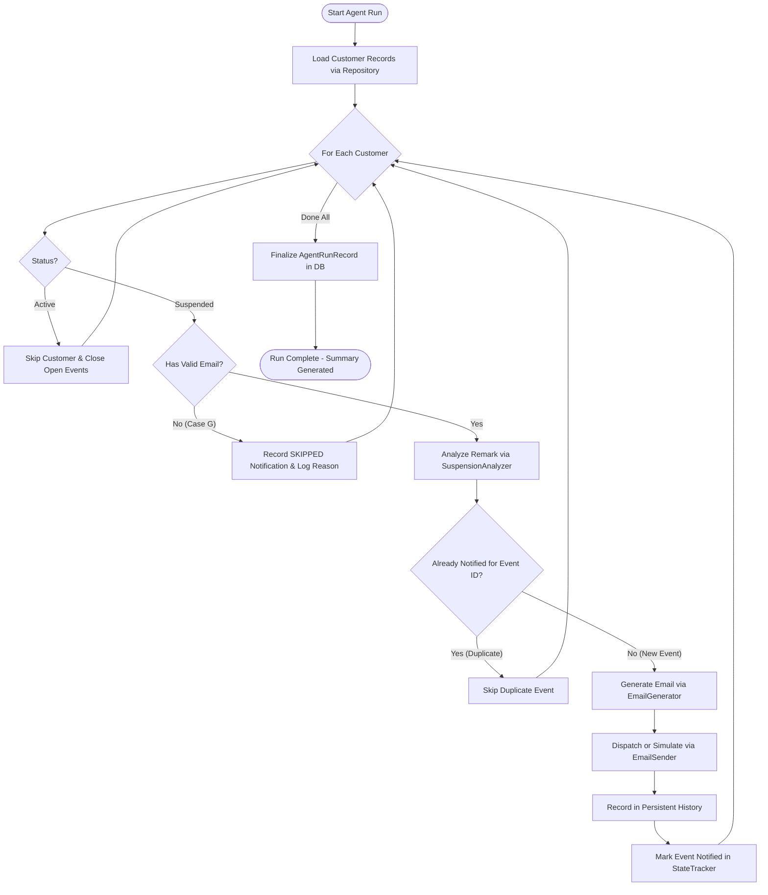

# Intelligent Customer Suspension Notification Agent

> **Internship Proof-of-Concept Project (SLT)**  
> **Important Business Context & Synthetic Data Statement:**  
> *The current implementation strictly uses synthetic sample data because access to the original SLT customer database is not currently available.*  
> No real SLT databases, customer information, personal contacts, or internal operational policies are accessed or used.

---

## 1. Project Overview & Business Problem

When telecommunication customers experience service suspensions (such as for overdue bills, pending verification, technical line work, or customer-requested holds), keeping them promptly and professionally informed is essential for customer experience, transparency, and operational clarity.

In enterprise telecom environments, manual tracking of suspended accounts is slow, error-prone, and can result in missed notifications or duplicate spam. This project introduces an **Intelligent Customer Suspension Notification Agent** that automatically:
- Monitors customer records.
- Identifies customers in `Suspended` status.
- Analyzes suspension remarks into deterministic categories (`BILL_OVERDUE`, `PAYMENT_NOT_RECEIVED`, `CUSTOMER_REQUESTED`, `TECHNICAL_ISSUE`, `ACCOUNT_ISSUE`).
- Generates professional, respectful emails strictly based on available facts without hallucinating fee amounts, dates, or policies.
- Prevents duplicate notifications for the same suspension event.
- Tracks customer lifecycle transitions (`Active ➔ Suspended ➔ Active ➔ Suspended`).
- Dispatches emails in a safe `SIMULATED` mode by default (with optional real SMTP).
- Persists all notification records and agent execution runs into an SQLite database.
- Provides a modern, responsive web dashboard with live controls for evaluation.

---

## 2. System Architecture

The project is structured with a decoupled full-stack architecture. The agent interacts exclusively through an abstracted **Data Access Layer (Repository Pattern)**, allowing the synthetic CSV source to be replaced with an authorized SLT database or API in the future without modifying any agent logic.

```
Intelligent Customer Suspension Notification Agent/
├── backend/
│   ├── agent/
│   │   ├── agent_runner.py          # Orchestrates batch execution cycle & summary logging
│   │   ├── suspension_analyzer.py   # Pattern classification engine (regex & keywords)
│   │   ├── notification_decision.py # Decision engine: status, missing email, duplicate check
│   │   ├── state_tracker.py         # Customer lifecycle tracking & suspension event IDs
│   │   ├── email_generator.py       # Template engine & optional Google Gemini LLM fallback
│   │   └── email_sender.py          # Safe simulation mode (default) vs SMTP dispatch
│   ├── api/
│   │   ├── routes_customers.py      # /api/customers (list, search, status update, single test)
│   │   ├── routes_agent.py          # /api/agent/run, /api/agent/status, /api/agent/runs
│   │   ├── routes_notifications.py  # /api/notifications (audit log, detailed email view)
│   │   └── routes_settings.py       # /api/stats, /api/settings, /api/dataset/reset
│   ├── data/
│   │   └── customer_repository.py   # CustomerRepository ABC + CsvCustomerRepository
│   ├── models/
│   │   ├── customer.py              # CustomerRecord, CustomerUpdate Pydantic models
│   │   ├── notification.py          # NotificationRecord, DeliveryStatus enum
│   │   └── agent_run.py             # AgentRunRecord, RunStatus enum
│   ├── storage/
│   │   └── database.py              # SQLite manager for notifications, runs & event states
│   ├── config.py                    # Environment settings loaded with pydantic-settings
│   └── main.py                      # FastAPI app entrypoint with CORS & routes
├── frontend/                        # React (Vite) Dashboard
│   ├── src/
│   │   ├── api.js                   # Client communication layer
│   │   ├── App.jsx                  # Main layout, tabs, polling & toast alerts
│   │   ├── index.css                # Polished design system (slate/indigo/cyan tokens)
│   │   ├── components/              # Navbar, MetricCard, EmailModal, EditCustomerModal
│   │   └── pages/                   # Dashboard, Customers, Suspended, Notifications, Runs, Settings
│   ├── package.json
│   └── vite.config.js               # Proxying /api to http://localhost:8000
├── data/
│   ├── customers.csv                # 100 fictional records (~70% Active, ~30% Suspended)
│   └── README.md                    # Detailed dataset documentation & test case breakdown
├── scripts/
│   └── generate_sample_data.py      # Script to regenerate dataset with custom seed & size
├── tests/                           # Comprehensive automated test suite
│   ├── test_suspension_analyzer.py  # Cases B, C, D, E, F and remark synonyms
│   ├── test_notification_decision.py# Case A (active) and Case G (missing email safety)
│   ├── test_duplicate_prevention.py # Duplicate prevention & lifecycle transitions
│   ├── test_email_generator.py      # Fact-only template verification & no hallucinations
│   ├── test_agent_runner.py         # Batch processing, simulation, and run history
│   └── test_customer_repository.py  # Data access layer atomicity & persistence
├── .env.example
├── .gitignore
├── requirements.txt
└── README.md
```

---

## 3. Agent Workflow



---

## 4. Key Features & Business Rules

### 4.1. Suspension Remark Classification
The `SuspensionAnalyzer` normalizes customer remarks and classifies them into:
- `BILL_OVERDUE`: Remarks containing "bill overdue", "unpaid bill", "outstanding payment".
- `PAYMENT_NOT_RECEIVED`: Remarks containing "payment not received", "non-payment".
- `CUSTOMER_REQUESTED`: Remarks containing "customer requested temporary suspension", "voluntary suspension", "service suspension".
- `TECHNICAL_ISSUE`: Remarks containing "technical issue", "service issue", "line maintenance".
- `ACCOUNT_ISSUE`: Remarks containing "account issue", "verification required", "kyc".
- `UNKNOWN`: Fallback for unrecognized wording.

### 4.2. Duplicate Notification Prevention
- When a customer transitions `Active ➔ Suspended`, the agent mints a unique `suspension_event_id` (e.g. `EVT-0116789001-1773740000`).
- Once notified, this event ID is marked in `customer_lifecycle_state`.
- On subsequent agent runs, if the status remains `Suspended`, the agent detects that `last_notified_event_id == current_event_id` and **skips notification**.
- If the customer transitions `Suspended ➔ Active ➔ Suspended`, reactivation closes the first event, and returning to `Suspended` mints a **fresh suspension event ID**, allowing a new notification to be dispatched!

### 4.3. Safe Email Generation & Delivery
- **Strict Guardrails**: The email generator references ONLY customer name, landline, category, and remark. It **never invents** rupee amounts, due dates, contact numbers, or legal threats.
- **Dual Mode**:
  - `SIMULATION` (Default): Logs and stores formatted email in DB with `SIMULATED` status. No SMTP server needed.
  - `REAL_SMTP`: Dispatches via configured host/port with TLS/SSL if enabled.
- **Optional LLM Integration**: Generates personalized emails using Google Gemini when `GEMINI_API_KEY` is provided, with instantaneous fallback to deterministic templates if offline, timed out, or unconfigured.

---

## 5. Getting Started & Installation

### Prerequisites
- **Python**: 3.10+ (tested on Python 3.13)
- **Node.js**: 18+ (tested on Node v22)

### Step 1: Install Python Dependencies
```bash
# In project root:
pip install -r requirements.txt
```

### Step 2: Install Frontend Dependencies
```bash
cd frontend
npm install
cd ..
```

### Step 3: Configure Environment Variables (Optional)
Copy `.env.example` to `.env`:
```bash
cp .env.example .env
```
*(Default settings automatically use safe SIMULATION mode and built-in templates. No API keys required).*

---

## 6. Running the Application

### Option A: Start Backend and Frontend Simultaneously

**Terminal 1 (Backend - FastAPI on port 8000):**
```powershell
python -m uvicorn backend.main:app --host 0.0.0.0 --port 8000 --reload
```

**Terminal 2 (Frontend - React Vite on port 3000):**
```powershell
cd frontend
npm run dev
```

Open your browser and navigate to: **`http://localhost:3000`** (or backend Swagger API docs at `http://localhost:8000/docs`).

---

## 7. Demonstration Workflow Walkthrough

The application is specifically equipped to demonstrate the required 11-step lifecycle workflow live:

| Step | Action in UI | Expected Result |
| :--- | :--- | :--- |
| **Step 1** | Go to **Customers** page and locate `Customer 001` (`0116789001`). | Status is currently `Active`. |
| **Step 2** | Click **Edit**, change Status to `Suspended`, set Remark to `Bill overdue`, click **Save**. | Customer record updated in CSV immediately. |
| **Step 3** | Navigate to **Dashboard** or **Suspended Customers** and click **[ RUN AGENT NOW ]**. | Agent initiates batch cycle, identifies `Customer 001` as suspended. |
| **Step 4** | Check Agent execution logs / Notification stream. | Remark "Bill overdue" analyzed as `BILL_OVERDUE`. |
| **Step 5** | Click **View Email** on the notification record. | Professional email generated with subject *"Service Suspension Notification - Outstanding Bill"*. |
| **Step 6** | Note the delivery status. | Status is `SIMULATED` (safe test mode). |
| **Step 7** | View **Notifications** page. | Full email and event ID are recorded in persistent SQLite history. |
| **Step 8** | Click **[ RUN AGENT NOW ]** a second time. | `Customer 001` is recognized as already notified for this event. **Duplicate prevented!** Notifications Sent = 0, Skipped = 1+. |
| **Step 9** | Go to **Customers**, click **Edit** on `Customer 001`, change Status back to `Active`, click **Save**. | Service is restored to Active. Suspension event cycle closed. |
| **Step 10** | Click **Edit** on `Customer 001`, change Status to `Suspended`, set Remark to `Payment not received`, click **Save**. | Re-enters suspended state with a new reason. |
| **Step 11** | Click **[ RUN AGENT NOW ]**. | Recognized as a **brand new suspension event**! Fresh email generated and recorded! |

---

## 8. Dataset Management

Regenerate or resize the synthetic dataset at any time:
```bash
# Generate 100 records with fixed random seed
python scripts/generate_sample_data.py --count 100

# Or 500 records
python scripts/generate_sample_data.py --count 500
```
You can also click **Reset to Clean 100 Records** on the **Settings** page in the UI.

---

## 9. Automated Testing

Run the full automated test suite using Python's built-in `unittest`:
```bash
python -m unittest discover -s tests -p "test_*.py"
```

### Verified Test Cases:
- `test_suspension_analyzer.py`:
  - Case B: Bill overdue & synonyms ➔ `BILL_OVERDUE`
  - Case C: Payment not received & non-payment ➔ `PAYMENT_NOT_RECEIVED`
  - Case D: Customer requested variations ➔ `CUSTOMER_REQUESTED`
  - Case E: Technical & service issues ➔ `TECHNICAL_ISSUE`
  - Case F: Account / KYC issues ➔ `ACCOUNT_ISSUE`
  - Unknown & blank remarks ➔ `UNKNOWN`
- `test_notification_decision.py`:
  - Case A: Active customers skipped
  - Case G: Missing or blank email handled safely without crashing
- `test_duplicate_prevention.py`:
  - Enforces duplicate prevention on identical events
  - Validates `Active ➔ Suspended ➔ Active ➔ Suspended` generates distinct events
- `test_email_generator.py`:
  - Verifies professional tone and ensures zero hallucinated fees or dates
  - Validates deterministic template fallback
- `test_agent_runner.py`:
  - Full batch run simulation and persistent execution logging
- `test_customer_repository.py`:
  - Atomic persistence and thread-safe CSV updates

---

## 10. Future Integration with Authorized SLT Database / API

To transition from this proof-of-concept to production when an authorized SLT database or API becomes available:
1. Create a new repository class in `backend/data/`:
   ```python
   class SltDatabaseRepository(CustomerRepository):
       def __init__(self, db_connection_string: str): ...
       def get_all(self) -> List[CustomerRecord]: ...
       def get_suspended(self) -> List[CustomerRecord]: ...
   ```
2. In `backend/main.py`, substitute `customer_repo = SltDatabaseRepository(...)`.
3. **No changes to `agent_runner.py`, `suspension_analyzer.py`, `state_tracker.py`, or the dashboard are required.**
